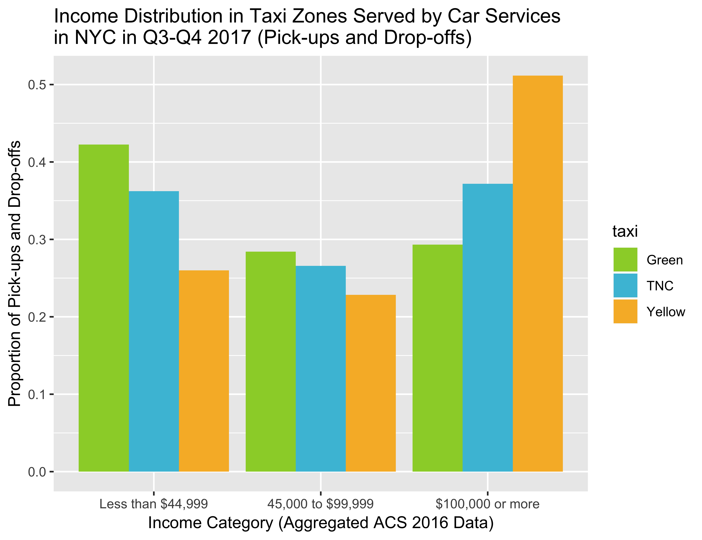

# tstc-taxi: Exploring the income distribution of NYC's car services

This repository is a visualization of the income distribution the areas served by different types of car services in New York City.

The repo contains the code required to download and process the raw data and produce plots of car service income distributions. It also contains, interstitial .RData files produced by the raw data processing.



## Directory Structure

The code is in R. This repo doesn't currently conform to the R package standard. The directory structure is as follows:

- `analyses`: Scripts to produce plots (and any other outputs to be added at a later date).
- `data-raw`: Scripts to download and process raw data. Raw data files are also downloaded to this directory. Outputs to `data`.
- `data`: Processed .RData files containing the processed and aggregated output of the scripts in `data-raw`.
- `figures`: The outputs of `analyses`.

## Running the Code

### R Setup

Make sure you've installed all the packages which are referenced by the scripts.

```r
install.packages(c("devtools", "tidyverse", "here", "sf", "viridis", "tidycensus" "scales"))
```

N.B. The maps in `analyses/plotting_scratch.R`, which are just some experimental maps, rely on the function `geom_sf()` in `ggplot2`. At time of writing (2018-06-01), this is only available in the development version. If you want to run that:

```r
library(devtools)
install_github("hadley/ggplot2")
```

### Downloading Raw Taxi Data

Run the `download_data_files.sh` script, which downloads (1) taxicab tripdata files from TLC for the second half of 2017 (the list of files is stored in `2017_tripdata_urls.txt`), (2) taxi zone shapefiles, and (3) the FHV (For Hire Vehicle) taxi bases CSV file from Todd Schneider's [nyc-taxi-data](https://github.com/toddwschneider/nyc-taxi-data) repo. We use the latter data file instead of any provided by the city because it lets us distinguish between transit network companies (TNCs) like Lyft and Uber and other for-hire non-taxi cars.

```bash
cd data-raw
./download_data_files.sh
cd ..
```

We only use the second half of 2017 because at the start of that year, TNCs didn't report the location of their pick-ups and drop-offs. The script `data-raw/plot_tnc_pudo_reporting.R` will plot this data, using downloading the requisite data files at runtime using `read_csv()`. Be warned, these are large files, so this script is fairly RAM-heavy and takes a while to run. It's not required to do the full analysis.


### Processing Taxi Data

The three scripts — `process_fhv_tripdata.R`, `process_yellow_tripdata.R`, and `process_green_tripdata.R` — each process the respective tripdata files for that type of car service.

All of these scripts read the tripdata files, and aggregate pick-ups only (PUs), drop-offs only (DOs), and pick-ups and drop-offs combined (PUDOs) by taxi zone, and save a data file with four columns: one for taxi zone, and one for each type of aggregation. (The interstitial data files are saved as .RData files containing tibbles in the `data` directory.)

Green and yellow cab data are processed identically. FHV data are first filtered by the taxi base of the car making the trip to separate TNCs and other FHVs. We save the other FHV data, but don't use it later on.

### Processing Census Data

The script `load_census_data.R` downloads and processes the census data used in the analysis.

N.B. To run this script, you must first [sign up for a US census API key](https://api.census.gov/data/key_signup.html). When you receive the key, put it in a file named `census_api_key` in the `data-raw` directory.

In this script:

1. We load the NYC taxi zone shapefiles.
2. We use the `tidycensus` package to download census data. This project uses the ACS 2016 question B19001. This gives the estimated number of households in income categories per census tract. We ignore the margin of error, and use only the estimate.
3. We split up census tracts by taxi zones. Where a census tract is split by a taxi zone, we apportion the households in each category to the different sections proprortional to the area of that census tract in each zone.
4. We group these tract sections by taxi zone and sum the apportioned households. This gives us an estimate of income distribution per taxi zone.
5. We tidy up the data slightly and save it to the `data` directory.

### Plotting Workflows

The scripts in the `analyses` directory aggregate the income distributions based on the number of visits to the taxi zones. There are three scripts; they do the same thing, except that they respectively aggregate drop-offs only, pick-ups only, and pick-ups and drop-offs.

Each script starts by loading the tidy taxi zone income distributions generated in `load_census_data.R`. We create a new variable representing the proportional distribution of that zone's income.

For each type of car service, we take the zone income proportion variable, and run a `left_join()`, combining it with the trip data, such that each trip's zone is  we load the files created in the data processing scripts. For each category, we join the zone income distribution with the trips. We then multiply each taxi zone's proportional distribution by the number of trips for that zone.

We then plot the resultant variable in a few different way — with all the ACS 2016 income categories, and collapsing the categories down to three categories.
